# Phone Farm(ing)

## Instructions for farm-station prototype

This is a guide for rebuilding the farm-station prototype of the Phone Farm(ing) project. For more information about the project visit [phonefarm.eu](www.phonefarm.eu).

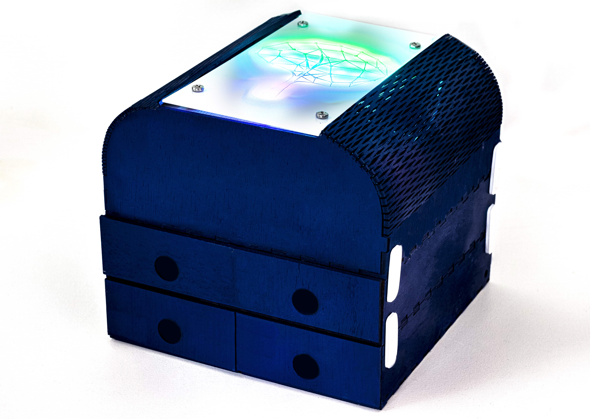

The prototype is a desktop version of the stations and showcases to approach of modularity and inveracity. It is divided
into two main components. The component on the top is the technical compartment which houses all electronics like the Raspberry Pi, a USB charging hub and the lights. On the top end, a sheet of acrylic is applied with interactive
backlighting that reacts on the number of phones connected to the farm. The second main component is the phone compartment. Each of them provides two lockable spaces for phones. All chambers are connected with 3D printed
joints, which makes it easy to add or to remove compartments depending on the requirement. 

The code managing the interactive lights is written in Python.

In this version, it is ideal for home use to lock away phones during mealtimes in the dining room or kitchen due it is the desktop size.

## Requirements:

For the cabinet, we will use

- one sheet of 3mm plywood (100x55cm)
- one A5 sheet of 3mm acrylic
- some adhesive fabric (I used poker table cover)
- 4 locks (optional)
- 4 screws
- 3D printer for the joints
- laser cutter to cut all parts
- paint

For the electronics, we'll need

- Raspberry Pi
- NeoPixel LED strip (30cm will be enough 60LEDs/m) with external power supply (5V)
- shrinking tube (optional)
- USB hub (externally powered)
- 4 charging cables
- some wires
- solder iron

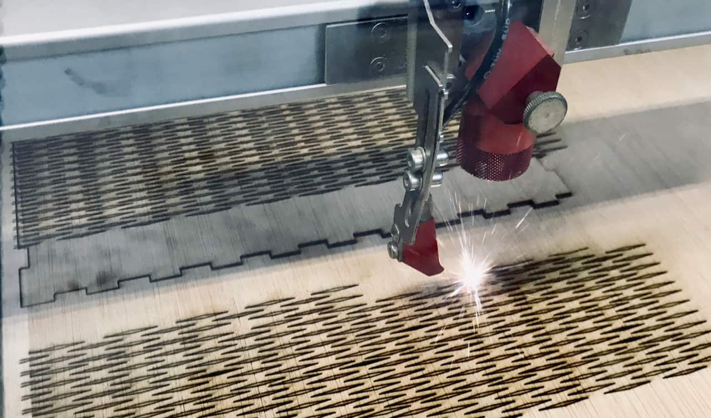

## 1. Step: cutting & print all parts

[Here](/cut_files/) you will find the Rhino and dxf files for cutting all components with the laser cutter. All parts are designed for 3mm plywood. I will add a parametric Fusion 360 model where the thickness of the material is adjustable.

The cut file contains, two phone compartments by default. You can add as many as you want.

In the same folder, you will find the Rhino and dxf file for the acrylic sheet as well.

[Here](/print_files/) you will find the 3D printing file for the joints for the default setting of one technical compartment and two phone compartments you will need eight joints in total.

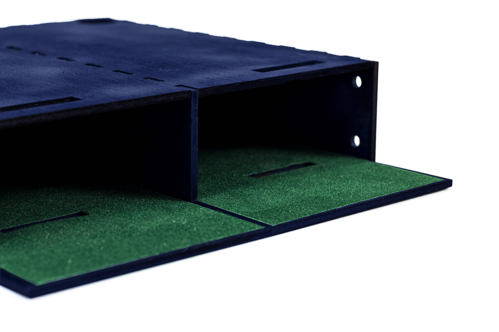

## 2. Step: add paint and fabric

After cutting the parts, test if they all fit together and the joints are working as they should. Assemble all three compartments for themselves and stuck them so that the joints fit perfectly into the holes.

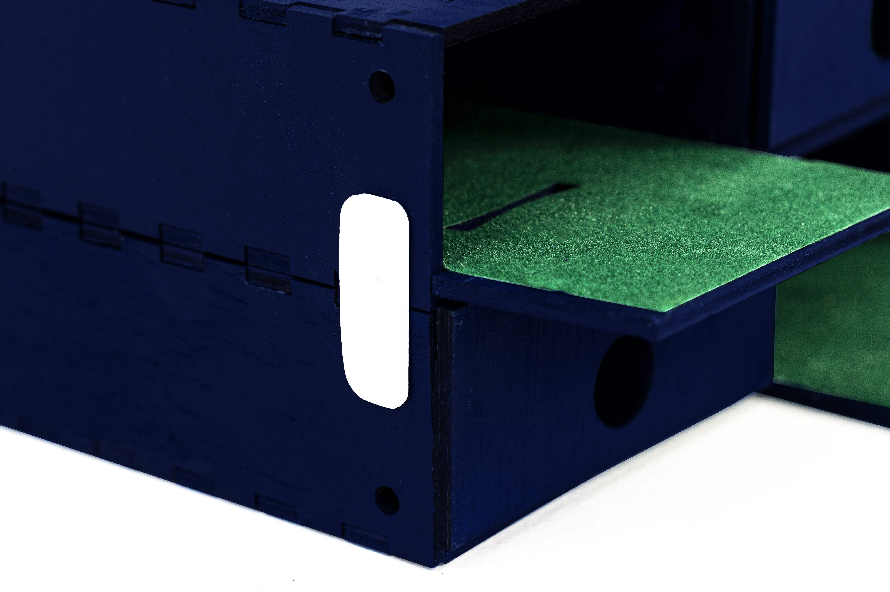

Now you can disassemble it again and paint the parts. The plywood bends very quickly when wet, so make sure it is thoroughly dry before assembly.

In the next step, you can add some fabric to the bottom part of the two phone compartments and the two doors. Lay them in front of the bottom part like they would be when the chambers are open. Now stick the fabric so that the bottom pieces and the doors are stuck together.

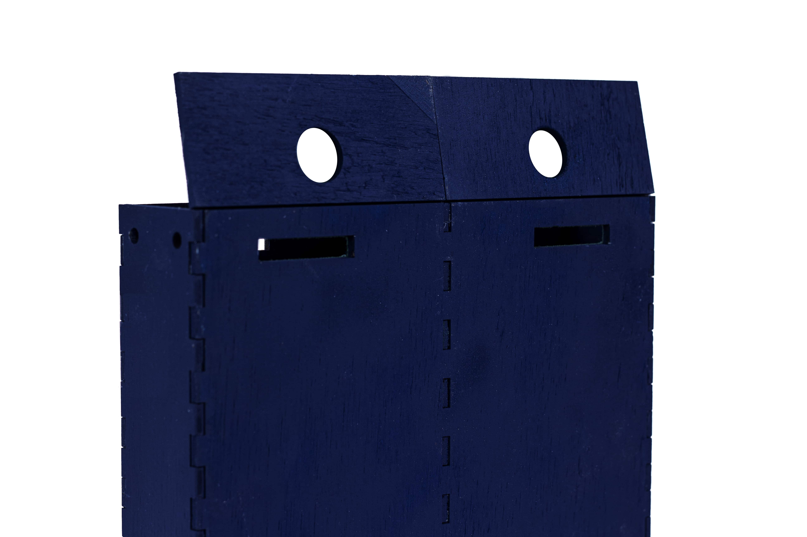

Assemble everything, and if needed, add some wood glue but be careful with the fabric. I used tape to fix the parts while the glue was drying.

The basic built should be ready now.

## 3. Step: prepare the lighting

Take the piece of plywood with the tree engraved on and add the lights. The light strip from BTF lighting I used is adhesive, but you can also use double-sided tape. [This](/pictures/closeup_lightsheet.jpg) photo shows the arrangement. It is crucial to think about the order before sticking it to the wood as you have to connect each output of a strip (DO) to an input (Din). You will find the essential points marked on the photo.

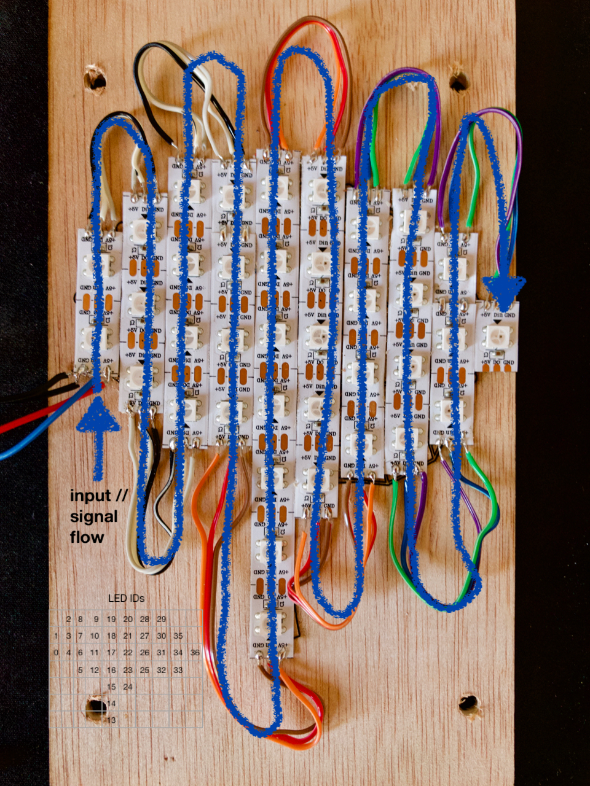

After adding all the lights, you need to connect them. I used flat cables, 3 for each connection. Be careful - you have to connect from GND to GND, 5V to 5V and DO to Din. The order is essential for the programming later as the code is following the order the LEDs are connected. I went from left to right in serpentine as seen on the photo.

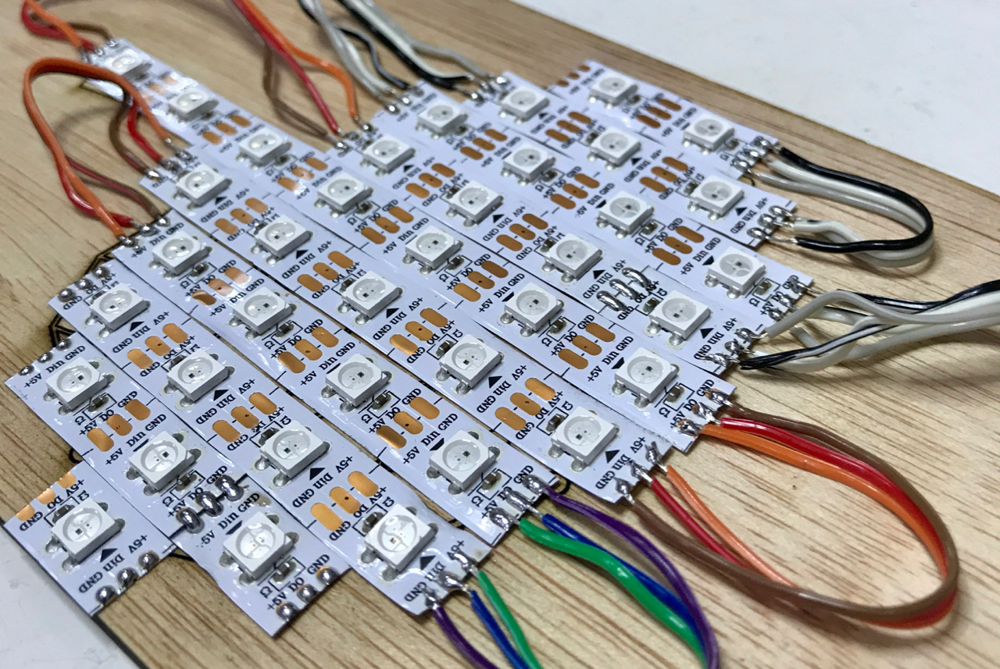

If not already connected, you can add the power supply to the first LED. I used a 5V AC and would recommend doing the same. You can check which one of the sides is V and GND with the multimeter. I used some shrinking tubes to isolate the connections properly, but you can also use isolation tape, of course.

In the final step, you have to add the signal wire and another ground wire for the Pi. Keep in mind the Pi has male pins, so it makes sense to add some wires with female connection. Add a wire to the ground connection and a wire to the Din pin of the first LED. Your final assembly should look like this:

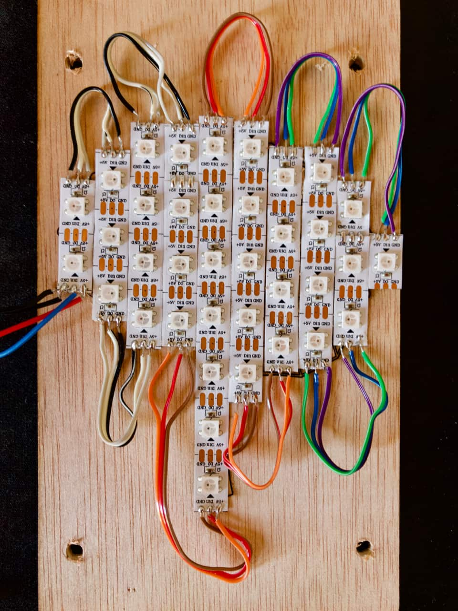

Optional step to test your lights: Before heading to the Raspberry Pi, which is a bit more complex, you can test your lights with an Arduino Uno. Connect the tree to GND and Pin 6 on your Arduino and connect to power and the Arduino to your computer. Open Arduino IDE. Select Tools > Manage Libraries and look for Adafruit NeoPixel. Install the library and go to File > Examples > Adafriut NeoPixel > strandtest. Change the LED_COUNT to the number of LEDs you used. If you built the same way, it would be 37. Upload the code, and now the tree should freak out in all different colours. If not, check all your connections again with the multimeter.

## 4. Step: Raspberry Pi and Python

In this step, we will set up the Raspberry Pi for controlling the LEDs with Python. Essential requirements for this step: A Pi with [Rasbian](https://www.raspberrypi.org/downloads/) installed, [VNC (optional but I prefer, or you can use a display, keyboard and mouse as well of course)](https://www.raspberrypi.org/documentation/remote-access/vnc/) and [SSH connection](https://www.raspberrypi.org/documentation/remote-access/ssh/). I linked guides to all three. I also used [Thonny Python IDE](https://thonny.org) as an editor, but you can use any editor you prefer. We will use Python 3 for the code.

### Wiring

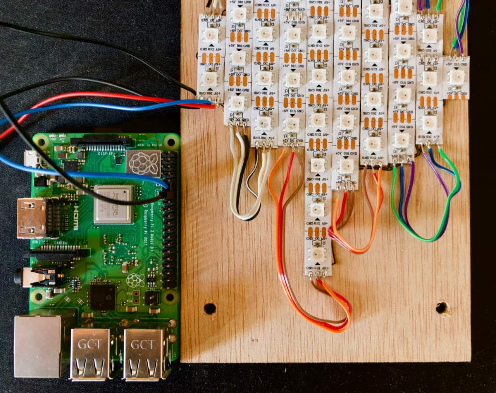

Connect the data wire of the LED to GPIO18 ([Raspberry Pi pinout](https://pinout.xyz)) and the GND wire to any GND pin. 

Before we start to code, we have to install some libraries and [CircuitPython](https://learn.adafruit.com/circuitpython-on-raspberrypi-linux). The following is the official guide to install CircuitPython.

### Update your Pi and Python

These steps are executed trough tour terminal application over ssh on your Pi.

```shell
sudo apt-get update
```


```shell
sudo apt-get upgrade
```

and

```shell
sudo pip3 install --upgrade setuptools
```

If above doesn't work try

```shell
sudo apt-get install python3-pip
```

### Enable I2C and SPI

If your GUI of your Pi is visible, you can go to the menu > Preferences > Raspberry Pi Configuration > Interfaces and set I2C and SPI to enable. If not, you can follow these two guides: [I2C](https://learn.adafruit.com/adafruits-raspberry-pi-lesson-4-gpio-setup/configuring-i2c) & [SPI](https://learn.adafruit.com/adafruits-raspberry-pi-lesson-4-gpio-setup/configuring-spi)

Reboot and than type following:

```shell
ls /dev/i2c* /dev/spi*
```

The result should be this:

```shell
/dev/i2c-1 /dev/spidev0.0 /dev/spidev0.1
```

#### Installing Python libraries

For the next step, make sure you have Python 3 installed.

Raspberry Pi GPIO library:

```shell
pip3 install RPI.GPIO
```

adafruit_blinka library:

```shell
pip3 install adafruit-blinka
```

To test if all libraries correctly installed, Adafruit provides the following test code:

```python
import board
import digitalio
import busio

print("Hello blinka!")

# Try to great a Digital input
pin = digitalio.DigitalInOut(board.D4)
print("Digital IO ok!")

# Try to create an I2C device
i2c = busio.I2C(board.SCL, board.SDA)
print("I2C ok!")

# Try to create an SPI device
spi = busio.SPI(board.SCLK, board.MOSI, board.MISO)
print("SPI ok!")

print("done!")

```

Safe the code as blinkatest.py Pi and run it with

```shell
python3 blinkatest.py

```

If everything went well, the result should be

```shell
Hello blinka!
Digital IO ok!
I2C ok!
SPI ok!
done!

```

Next step is to install the NeoPixel library.

```shell
sudo pip3 install rpi_ws281x adafruit-circuitpython-neopixel

```

Now we should be able to write code in python and control the pins. You can test with the [following code](/programming_files/green_LED_test.py). All LEDs should be green. It is essential to run all the codes as root so every code should be executed similar to this

```shell
sudo python3 green_LED_test.py

```

Green LED test:

```python
# Simple test for NeoPixels on Raspberry Pi: all LEDs green
import time
import board
import neopixel


# Choose an open pin connected to the Data In of the NeoPixel strip, i.e. board.D18
# NeoPixels must be connected to D10, D12, D18 or D21 to work.
pixel_pin = board.D18

# The number of NeoPixels
num_pixels = 37

# The order of the pixel colors - RGB or GRB. Some NeoPixels have red and green reversed!
# For RGBW NeoPixels, simply change the ORDER to RGBW or GRBW.
ORDER = neopixel.GRB

pixels = neopixel.NeoPixel(pixel_pin, num_pixels, brightness=10, auto_write=False, pixel_order=ORDER)

pixels.fill((0, 255, 0))
pixels.show()

```

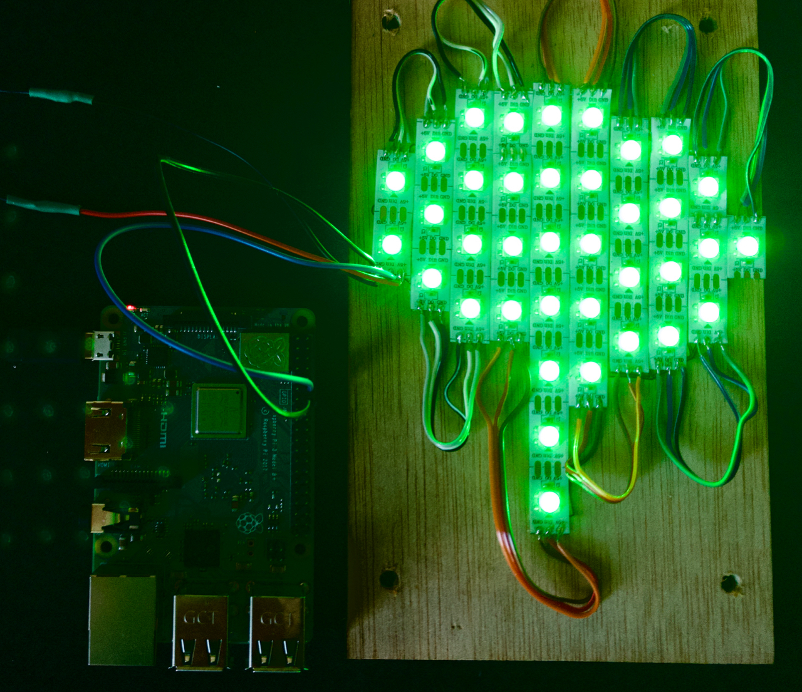

The next step is to identify each LED with a number. I used a [sheet](/programming_files/LED_IDs.xlsx) for that and added the numbers of the LEDs in the order I connected them. It starts at 0 and not with one. If you built the tree the same way I did, you could follow my sheet. You can test it by changing the green test program and replace the pixels.fill line with

```python
pixels[0] = (255, 0, 0)

```

You can replace the 0 with any ID of your LED array and check if it is matching with your sheet.

With the following [code](/programming_files/gradient_LEDs.py), we add a gentle gradient from bottom to top from blue to green. You will find a [guide](https://circuitpython.readthedocs.io/projects/neopixel/en/latest/) here how the NeoPixel library works precisely and how to change colours.

```python
# create a nice gradient from blue to green
import time
import board
import neopixel


# Choose an open pin connected to the Data In of the NeoPixel strip, i.e. board.D18
# NeoPixels must be connected to D10, D12, D18 or D21 to work.
pixel_pin = board.D18

# The number of NeoPixels
num_pixels = 37

# The order of the pixel colors - RGB or GRB. Some NeoPixels have red and green reversed!
# For RGBW NeoPixels, simply change the ORDER to RGBW or GRBW.
ORDER = neopixel.GRB

pixels = neopixel.NeoPixel(pixel_pin, num_pixels, brightness=10, auto_write=False, pixel_order=ORDER)

#define different colors
one_blue = (30,0,255)
two_blue = (10, 80, 220)
three_blue = (0, 160, 160)
green_blue = (0, 180, 80)
one_green = (0, 220, 60)
two_green = (0, 255, 20)

#1stlevel
pixels[13] = one_blue
pixels[14] = one_blue

#2ndlevel
pixels[15] = two_blue
pixels[24] = two_blue

#3rdlevel
pixels[5] = three_blue
pixels[12] = three_blue
pixels[16] = three_blue
pixels[23] = three_blue
pixels[25] = three_blue
pixels[32] = three_blue
pixels[33] = three_blue

#4thlevel
pixels[0] = green_blue
pixels[4] = green_blue
pixels[6] = green_blue
pixels[11] = green_blue
pixels[17] = green_blue
pixels[22] = green_blue
pixels[26] = green_blue
pixels[31] = green_blue
pixels[34] = green_blue
pixels[36] = green_blue

#5thlevel
pixels[1] = one_green
pixels[3] = one_green
pixels[7] = one_green
pixels[10] = one_green
pixels[18] = one_green
pixels[21] = one_green
pixels[27] = one_green
pixels[30] = one_green
pixels[35] = one_green

#6thlevel
pixels[2] = two_green
pixels[8] = two_green
pixels[9] = two_green
pixels[19] = two_green
pixels[20] = two_green
pixels[28] = two_green
pixels[29] = two_green

#resetcommand
pixels.show()

```

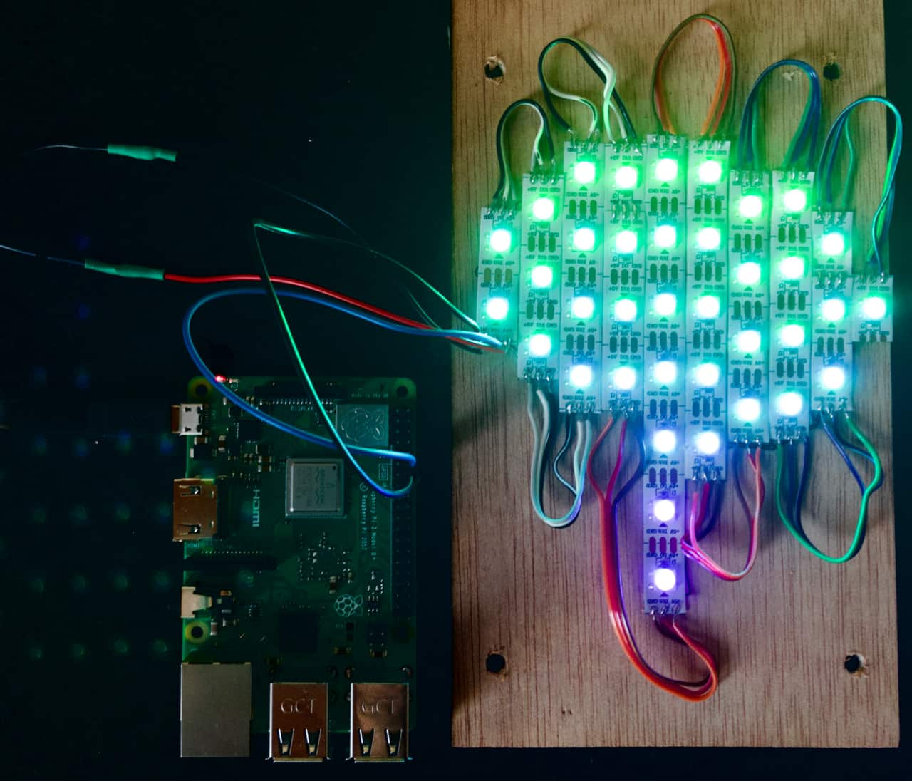

## Step 5: device managment

The goal is to set the lights up as if a phone is connected for charging a part of the tree lights up. Therefore we are us lsusb as device manager in Linux to monitor how many devices are connected. First, we need to connect the USB hub to the Pi to see what is amount 0 if the hub is connected. In my case, it is 6. You can type in terminal lsusb and count the devices popping up.

```python
#Phone Farm(ing) demo code
import re
import subprocess
import time
import board
import neopixel

# Choose an open pin connected to the Data In of the NeoPixel strip, i.e. board.D18
# NeoPixels must be connected to D10, D12, D18 or D21 to work.
pixel_pin = board.D18

# The number of NeoPixels
num_pixels = 37

# The order of the pixel colors - RGB or GRB. Some NeoPixels have red and green reversed!
# For RGBW NeoPixels, simply change the ORDER to RGBW or GRBW.
ORDER = neopixel.GRB

pixels = neopixel.NeoPixel(pixel_pin, num_pixels, brightness=10, auto_write=False, pixel_order=ORDER)

#define different colors
one_blue = (30,0,255)
two_blue = (10, 80, 220)
three_blue = (0, 160, 160)
green_blue = (0, 180, 80)
one_green = (0, 220, 60)
two_green = (0, 255, 20)


device_re = re.compile("Bus\s+(?P<bus>\d+)\s+Device\s+(?P<device>\d+).+ID\s(?P<id>\w+:\w+)\s(?P<tag>.+)$", re.I)

def CountDevices():
    df = subprocess.check_output("lsusb")
    devices = []
    for i in df.split('\n'):
        if i:
            info = device_re.match(i)
            if info:
                dinfo = info.groupdict()
                dinfo['device'] = '/dev/bus/usb/%s/%s' % (dinfo.pop('bus'), dinfo.pop('device'))
                devices.append(dinfo)
    #print (devices.count(1))

#change here to the count of devices when only your empty USB hub is connected
    return len(devices) -4

def LEDcontrol():
    if CountDevices() == 0:
        #1stlevel
        pixels[13] = one_blue
        pixels[14] = one_blue
    elif CountDevices() == 1:
        #1stlevel
        pixels[13] = one_blue
        pixels[14] = one_blue
        #2ndlevel
        pixels[15] = two_blue
        pixels[24] = two_blue
    elif CountDevices() == 2:
        #1stlevel
        pixels[13] = one_blue
        pixels[14] = one_blue
        #2ndlevel
        pixels[15] = two_blue
        pixels[24] = two_blue
        #3rdlevel
        pixels[5] = three_blue
        pixels[12] = three_blue
        pixels[16] = three_blue
        pixels[23] = three_blue
        pixels[25] = three_blue
        pixels[32] = three_blue
        pixels[33] = three_blue
    elif CountDevices() == 3:
        #1stlevel
        pixels[13] = one_blue
        pixels[14] = one_blue
        #2ndlevel
        pixels[15] = two_blue
        pixels[24] = two_blue
        #3rdlevel
        pixels[5] = three_blue
        pixels[12] = three_blue
        pixels[16] = three_blue
        pixels[23] = three_blue
        pixels[25] = three_blue
        pixels[32] = three_blue
        pixels[33] = three_blue
        #4thlevel
        pixels[0] = green_blue
        pixels[4] = green_blue
        pixels[6] = green_blue
        pixels[11] = green_blue
        pixels[17] = green_blue
        pixels[22] = green_blue
        pixels[26] = green_blue
        pixels[31] = green_blue
        pixels[34] = green_blue
        pixels[36] = green_blue
    elif CountDevices() == 4:
        #1stlevel
        pixels[13] = one_blue
        pixels[14] = one_blue
        #2ndlevel
        pixels[15] = two_blue
        pixels[24] = two_blue
        #3rdlevel
        pixels[5] = three_blue
        pixels[12] = three_blue
        pixels[16] = three_blue
        pixels[23] = three_blue
        pixels[25] = three_blue
        pixels[32] = three_blue
        pixels[33] = three_blue
        #4thlevel
        pixels[0] = green_blue
        pixels[4] = green_blue
        pixels[6] = green_blue
        pixels[11] = green_blue
        pixels[17] = green_blue
        pixels[22] = green_blue
        pixels[26] = green_blue
        pixels[31] = green_blue
        pixels[34] = green_blue
        pixels[36] = green_blue
        #5thlevel
        pixels[1] = one_green
        pixels[3] = one_green
        pixels[7] = one_green
        pixels[10] = one_green
        pixels[18] = one_green
        pixels[21] = one_green
        pixels[27] = one_green
        pixels[30] = one_green
        pixels[35] = one_green
        #6thlevel
        pixels[2] = two_green
        pixels[8] = two_green
        pixels[9] = two_green
        pixels[19] = two_green
        pixels[20] = two_green
        pixels[28] = two_green
        pixels[29] = two_green

#resetcommand
pixels.show()


while True:
    print (CountDevices())
    LEDcontrol()
    time.sleep(0.1)

```

For every connected device, the tree lights up a bit more.

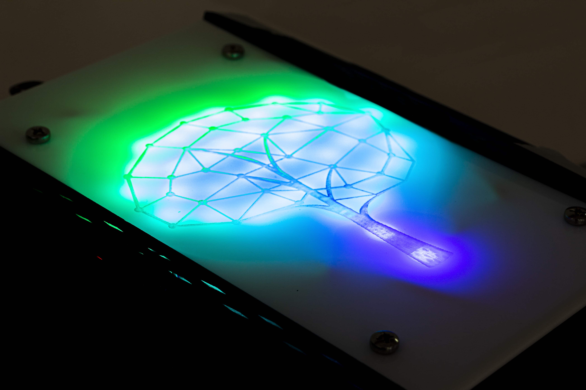

## Step 6: final assembling

Now we can assemble everything. Add the acrylic sheet to the lights and fix it with some screws through the holes as seen on the [photos](/pictures/screws.jpg). Place all electronics in the top compartment. The holes in the back of the box are for the charging wires going to the phone compartments. Connect all chambers with the joints and add the acrylic tree on the top like in the photo. You can add locks each door to make them, or you can also add some magnets if it's for your provide use to make them closable. It is essential that the locks are fitting the holes and the cutouts of the sheets. Measure your locks before you cut and adjust the files when necessary.

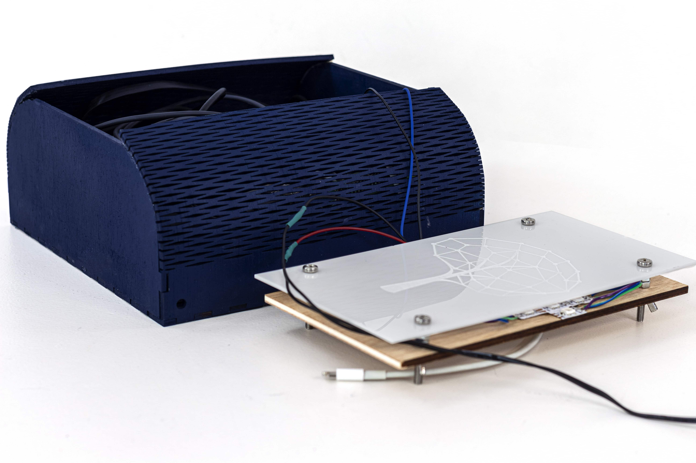

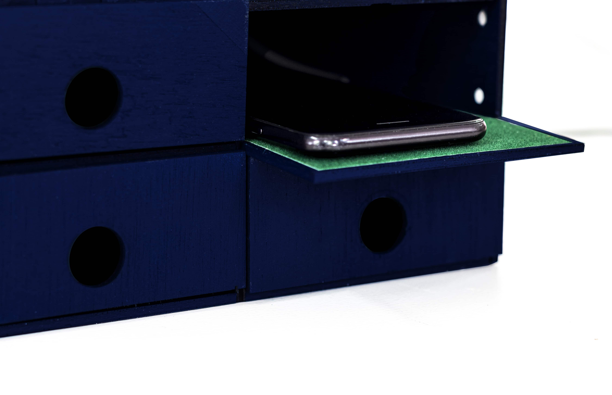

.jpg)

Feel free to share pictures, suggestions or thoughts about this project. 